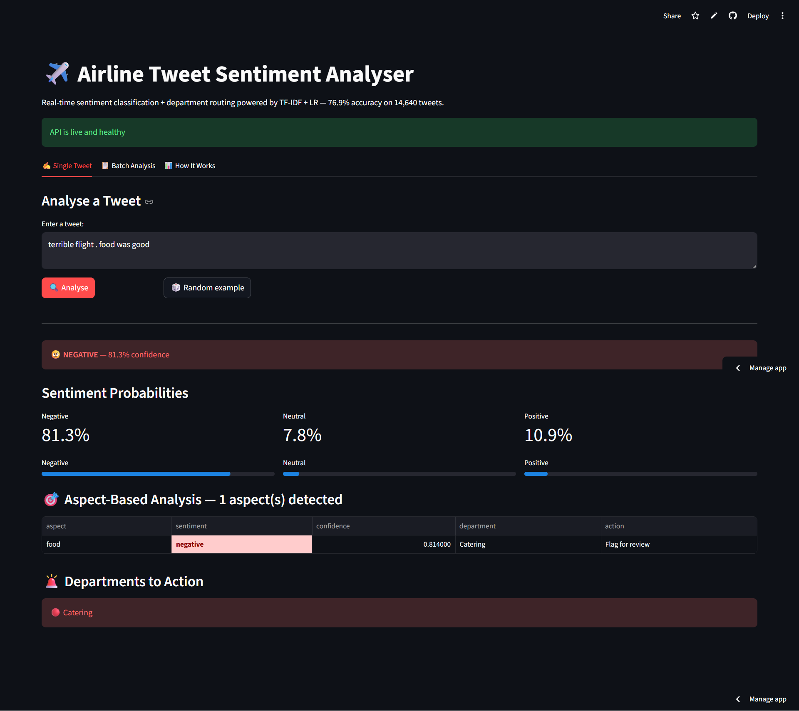

# ✈️ Twitter Airline Sentiment Analysis

Classifies airline tweets into Positive / Neutral / Negative using TF-IDF + Logistic Regression (76.9% accuracy) and BERT transformer. Features Aspect-Based Sentiment Analysis (ABSA), SQL Brand Analysis, WordCloud, Airline Brand Scorecard, and a live dual-model prediction system.

## Live Deployments
| | URL |
|--|--|
| REST API | https://sentiment-analysis-api-oegw.onrender.com |
| API Docs | https://sentiment-analysis-api-oegw.onrender.com/docs |
| Streamlit App | https://sentiment-analysis-api-kv.streamlit.app |

## Screenshots
### Streamlit Dashboard



## 🔍 What Makes This Unique
- **Dual Model System** — TF-IDF + LR vs BERT with smart conflict resolution (BERT overrides TF-IDF on negation — "not great" → NEGATIVE)
- **ABSA** — Aspect-Based Sentiment Analysis using clause splitting + BERT. Routes complaints to correct department (food → Catering, staff → HR, baggage → Baggage team)
- **SQL Brand Analysis** — Airline scorecard, complaint routing, confidence analysis using CTEs and PARTITION BY window functions
- **WordCloud** — visual word drivers per sentiment class (Negative / Neutral / Positive)
- **Airline × Complaint Heatmap** — which airline gets which complaint type most
- **Airline Brand Scorecard** — ranks all 6 airlines by sentiment score with stacked chart
- **Live Prediction** — free text input with dual model comparison + final decision logic

## 📊 Dataset
Twitter US Airline Sentiment — 14,640 real tweets · 3 classes
Negative: 63% · Neutral: 21% · Positive: 16%

## What's Inside
- TF-IDF vectorizer (15,000 features, trigrams)
- 4-model comparison: Naive Bayes, LR, Random Forest, XGBoost
- BERT comparison — proves domain-tuned TF-IDF beats base BERT
- ABSA: routes complaints to Catering / HR / Operations / Baggage
- SQL brand scorecard with PARTITION BY sentiment ranking

## ABSA Department Routing
```json
{
  "aspect": "luggage", "sentiment": "negative",
  "department": "Baggage Operations", "action": "Flag for review"
}
```

## Tech Stack
Python · TF-IDF · BERT · HuggingFace · ABSA · FastAPI · Docker · Streamlit · SQLite · Render

## Related
- API repo: [Sentiment-Analysis-API](https://github.com/KV0217/Sentiment-Analysis-API)


## 📈 Model Results
| Model | Accuracy |
|-------|----------|
| Naive Bayes | ~72% |
| **Logistic Regression (Tuned)** | **76.9%** |
| Random Forest | ~74% |
| XGBoost | ~75% |
| BERT (zero-shot) | ~72-75% |

## 🗄️ SQL Highlights
```sql
-- Top 3 Complaints per Airline (PARTITION BY + RANK)
WITH complaint_ranked AS (
    SELECT airline, negativereason, COUNT(*) AS complaints,
        RANK() OVER (
            PARTITION BY airline
            ORDER BY COUNT(*) DESC
        ) AS complaint_rank
    FROM tweets
    WHERE airline_sentiment = 'negative'
    GROUP BY airline, negativereason
)
SELECT * FROM complaint_ranked WHERE complaint_rank <= 3
```

## 🤖 ABSA Aspects
| Aspect | Keywords | Routes To |
|--------|----------|-----------|
| ⏱️ Punctuality | delay, cancel, late | Operations |
| 🍽️ Food | meal, drink, snack | Catering |
| 👨‍✈️ Staff | crew, rude, helpful | HR/Training |
| 🧳 Baggage | lost, luggage, bag | Baggage team |
| 💺 Comfort | seat, legroom, cramped | Cabin crew |
| 📱 Booking | app, website, checkin | IT/Support |

## 🔑 Key Insights
- Negative tweets dominate — 63% of all airline tweets
- United Airlines has worst sentiment score
- Virgin America has best sentiment score
- Top complaints: Customer Service · Late Flights · Lost Baggage
- TF-IDF fails on negation ("not great") — BERT handles correctly
- Domain-matched TF-IDF beats large zero-shot BERT


## 👤 Author
**KAVIN VENKAT**
[LinkedIn](https://www.linkedin.com/in/kvsherly17100210) 
